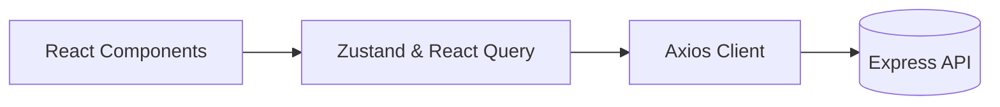

# Diamond Frontend


## Project Title

Diamond Frontend is a React + Vite single-page application for
managing diamond operations. It covers authentication, master data,
diamond lots, rates, transactions, employees, and attendance with a
responsive dashboard UI.

## Installation

- Node.js: >= 18
- Package manager: npm or yarn
- Install dependencies:

```bash
npm install
# or
yarn install
```

## Development Setup

- API endpoint:
  - Local: `http://localhost:8000/api`
  - Production (example): `https://diamond-backend-t6cb.onrender.com/api`
  - Configured in `src/Lib/api.js`.
- Environment variables:
  - Optional: `VITE_*` variables can be added later if needed.
- Start dev server:

```bash
npm run dev
```

The app runs on `http://localhost:5173`.

### Diagram



## Build Instructions

- Build command:

```bash
npm run build
```

- Output directory: `dist/`
- Optimizations:
  - Vite production build (code splitting, minification, hashed assets).
  - React optimized runtime with fast refresh in dev.

## Testing

- Test suites: not configured.
- Linting:

```bash
npm run lint
```

Add testing later with Vitest/Jest if desired.

## Deployment

- Static hosting (Vercel, Netlify, S3 + CDN).
- Vercel:
  - Uses `vercel.json` rewrites to support SPA routing.
  - Set backend API URL (if different) in `src/Lib/api.js`.
- Steps:
  - Build locally or let the platform build.
  - Deploy `dist/` as the static output.

## Project Structure

```
Frontend/
├─ index.html
├─ package.json
├─ eslint.config.js
├─ vercel.json
└─ src/
   ├─ App.jsx
   ├─ main.jsx
   ├─ index.css
   ├─ Lib/api.js
   ├─ Components/
   ├─ Pages/
   ├─ Context/
   ├─ Hooks/
   └─ Store/
```

## Contributing

- Branching: feature branches; PRs into `main`.
- Commit messages: Conventional Commits (`feat:`, `fix:`, `docs:`).
- PRs: include description, screenshots for UI, and lint pass.
- Style: follow ESLint rules and keep components focused.

## License

This project currently does not contain an explicit license.